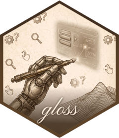

<!-- README.md is generated from README.Rmd. Please edit that file -->

```{r, include = FALSE}
knitr::opts_chunk$set(
  collapse = TRUE,
  comment = "#>",
  fig.path = "man/figures/README-",
  out.width = "100%"
)
```

 # gloss <a href="https://schochastics.github.io/gloss/"></a>

<!-- badges: start -->
[](https://github.com/schochastics/gloss/actions/workflows/R-CMD-check.yaml)
<!-- badges: end -->

**gloss** turns a [vellum](https://github.com/schochastics/vellum) scene — or a
[quill](https://github.com/schochastics/quill) plot — into a self-contained, client-side interactive HTML
widget: **hover tooltips + highlighting, click selection, rectangular
brush-select, pan/zoom, and a toolbar**, with no Shiny and no server round-trip.
It is the host adapter of the vellum interactivity stack: `vellum` emits
per-element `data-key`s, bounding boxes, and a `scene_model()` element table,
`quill` declares what is interactive, and `gloss` hosts it.

**Interactions:** hover (tooltip + highlight, with nearest-mark snapping and
`hover_group` linking) · click-select (single/multiple) · drag a rectangle to
brush-select · wheel / pan-drag to pan-zoom · discrete-legend interaction (hover
a swatch to highlight its series, click to select it) · toolbar (mode toggle,
zoom-to-selection, reset, save SVG/PNG, fullscreen). Each is opt-outable via an
`as_widget()` argument.

> The name is the manuscript *gloss* — an annotation revealed on the page.

## Installation

```r
# install.packages("pak")
pak::pak("schochastics/gloss")
```

gloss builds on the [vellum](https://github.com/schochastics/vellum) backend
(and works with [quill](https://github.com/schochastics/quill) plots); pak pulls
them in automatically. vellum compiles a Rust crate, so a Rust toolchain
(`cargo`/`rustc`) is needed to build it.

## Usage

```r
library(quill)
library(gloss)

df <- data.frame(wt = mtcars$wt, mpg = mtcars$mpg, model = rownames(mtcars))

vplot(df) |>
  mark_point(x = wt, y = mpg, tooltip = model, data_id = model) |>
  as_widget()
```

`as_widget()` is terminal: it compiles the plot to a vellum scene, emits the SVG
and the element table, and returns an htmlwidget. It also accepts a bare `vellum`
scene. Declare interactivity in `quill` with the reserved mark arguments
`data_id` (the join key), `tooltip`, and `hover_group` (links elements for shared
highlighting); discrete `color`/`shape` legends then become interactive
automatically. A plot that declares none renders as a static — but still
embeddable — SVG.

## How it depends

```
gloss ──depends──▶ vellum ◀──depends── quill
```

`gloss` depends only on `vellum`'s `scene_svg()` / `scene_model()` contract, so it
wraps *any* vellum scene, whoever produced it. `quill` is a Suggests (for the
examples/tests).

## Development

The JS runtime is TypeScript in `srcts/`, bundled by esbuild into the committed
`inst/htmlwidgets/gloss.js` (so the R package installs with no Node):

```sh
npm install            # esbuild + typescript (+ jsdom for tests)
npm run build          # srcts/index.ts -> inst/htmlwidgets/gloss.js
node tests/js/behavior.test.js   # headless DOM behaviour suite
```

## Styling the interactions

Hover/selection appearance is customisable at two levels that compose — a
widget-wide **theme** and per-element **grammar** colours. Both accept any R or
CSS colour; per-element colours win over the theme, which wins over the built-in
defaults.

**1. Widget theme** — `as_widget()` arguments set the look for the whole plot:

```r
library(quill)
library(gloss)

df <- data.frame(wt = mtcars$wt, mpg = mtcars$mpg, model = rownames(mtcars))

vplot(df) |>
  mark_point(x = wt, y = mpg, tooltip = model, data_id = model) |>
  as_widget(
    hover_color    = "steelblue",  # outline on hover (default: none, just dim-others)
    selected_color = "orange",     # outline on click-select
    dim_opacity    = 0.15          # how much the non-hovered marks fade (default 0.28)
  )
```

**2. Per-element (data-driven) grammar** — declare `hover_color` / `selected_color`
on the mark, just like `tooltip`/`data_id`. They can be constants or mapped from a
column, so different marks highlight differently:

```r
df$cyl <- factor(mtcars$cyl)

vplot(df) |>
  mark_point(
    x = wt, y = mpg, data_id = model,
    hover_color    = ifelse(mtcars$cyl == 8, "firebrick", "steelblue"),
    selected_color = "black"
  ) |>
  as_widget()          # a per-element colour overrides any widget theme
```

Both layers use the same CSS-variable mechanism, so a plot can set a theme default
*and* override it per element in the same pipe. Anything not set falls back to the
built-in look. (You can also override the raw CSS classes — `.gloss-hl`,
`[data-key].gloss-selected`, `.gloss-tip`, … — from the host document, but the
arguments above are the supported API.)

## Linking views

Selection can be **linked across views** by data key — select or brush in one
plot and the same data highlight everywhere.

**Own bus (gloss ↔ gloss, no dependency).** Give the widgets a shared `group`:

```r

df$hp <- mtcars$hp

p1 <- vplot(df) |> mark_point(x = wt, y = mpg, data_id = model) |> as_widget(group = "cars")
p2 <- vplot(df) |> mark_point(x = hp, y = qsec, data_id = model) |> as_widget(group = "cars")
# in an HTML doc, selecting a point in p1 highlights the same car in p2
```

Selection **projects by field**: if the marks declare `hover_group`, clicking one
element selects the whole series (select one cylinder count → all its cars).

**crosstalk (interop with plotly, leaflet, DT, and `filter_*` inputs).** Wrap the
data in a [crosstalk](https://rstudio.github.io/crosstalk/) `SharedData` (its key
must match your `data_id`) and pass it to `as_widget()`:

```r
library(crosstalk)
sd <- SharedData$new(df, key = ~model, group = "cars")

bscols(
  vplot(sd$origData()) |> mark_point(x = wt, y = mpg, data_id = model) |> as_widget(crosstalk = sd),
  DT::datatable(sd)      # selecting rows / points links both ways
)
filter_slider("hp", "Horsepower", sd, ~hp)   # crosstalk's filter inputs hide non-matching marks
```

gloss uses its own selection engine and layers crosstalk on top as an optional
bridge (a `SelectionHandle` + `FilterHandle`), so a crosstalk filter hides the
non-matching marks (display-tier cross-filter) and selection round-trips with the
other widgets. The crosstalk client library is pulled in only when you pass a
`SharedData`.

## Legend interaction

When a plot maps a **discrete** `color` or `shape` scale and declares any
interactivity (e.g. a `data_id`), each legend swatch becomes a handle for its
whole data series — **no extra arguments needed**:

```r
df <- data.frame(
  wt = mtcars$wt, mpg = mtcars$mpg,
  model = rownames(mtcars), cyl = factor(mtcars$cyl)
)
vplot(df) |>
  mark_point(x = wt, y = mpg, color = cyl, data_id = model) |>
  as_widget()
# hover the "6" swatch -> all six-cylinder cars highlight (the swatch stays lit);
# click it -> the whole series is selected (respecting single/multiple mode).
```

`quill` tags each swatch with the series it drives and each mark with its series
membership; gloss projects a swatch event onto every mark in that series, reusing
the same highlight/select machinery as `hover_group`. Selecting via a swatch also
links across views and into crosstalk, exactly like selecting a mark.

## The vellum ecosystem

gloss is the interactivity layer of a small ecosystem of packages that share the
vellum scene model:

- **[vellum](https://github.com/schochastics/vellum)** — the parchment: the
  low-level graphics backend (Rust scene graph, PNG/SVG/PDF renderer).
- **[quill](https://github.com/schochastics/quill)** — the pen: a pipe-first
  grammar of graphics that compiles a plot spec into a vellum scene.
- **[gloss](https://github.com/schochastics/gloss)** — the gloss: this package.
- **[scriptorium](https://github.com/schochastics/scriptorium)** — installs and
  loads the whole ecosystem in one step.
