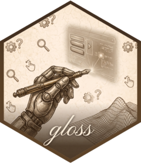

<!-- README.md is generated from README.Rmd. Please edit that file -->

# vellumwidget <a href="https://r-vellum.github.io/vellumwidget/"></a>

<!-- badges: start -->

[](https://github.com/r-vellum/vellumwidget/actions/workflows/R-CMD-check.yaml)
<!-- badges: end -->

**vellumwidget** turns a [vellum](https://github.com/r-vellum/vellum)
scene — or a [vellumplot](https://github.com/r-vellum/vellumplot) plot —
into a self-contained, client-side interactive HTML widget: **hover
tooltips + highlighting, click selection, rectangular brush-select,
pan/zoom, and a toolbar**, with no Shiny and no server round-trip.

It adds no drawing code of its own, and that is the point. `vellum`
emits the SVG together with a `scene_model()` table giving every
element’s data key and its resolved device-pixel box, and
`element_geometry()` giving the true vertices behind that box;
`vellumplot` declares which marks are interactive; and `vellumwidget` is
a thin client over those two. So the widget shows *the same scene* as
your static figure — same layout, same text metrics, same geometry —
rather than a re-drawing of your plot in another engine, and behaviour
that needs positions (a rectangular brush, pan/zoom, arrow-key
navigation between marks) is a table lookup rather than new machinery.

Because the geometry is the engine’s own, picking measures to the
*mark*: a cursor on a line picks that line rather than whichever series’
bounding box it happens to fall inside, a click in the middle of a
filled region hits the region, and a graph edge is hoverable along its
length instead of anywhere in the rectangle its endpoints span.

Client-side interactivity from R is not new: `ggiraph` has done it well
for years. What differs here is where the identity comes from (a
geometry table rather than tagged elements plus CSS) and that there are
no `*_interactive()` twins of the marks to remember.

**Interactions**, all on by default — hover (tooltip + highlight, with
nearest-mark snapping and `hover_group` linking) · click-select · drag a
rectangle to brush-select or a freehand lasso · wheel / pan-drag to
pan-zoom, re-ticking the axes rather than stretching them ·
discrete-legend interaction (hover a swatch to highlight its series,
click to select) · continuous colorbar filter (drag a value range to
fade out-of-range marks) · linked views across a `group` (selection,
hover, and pan/zoom) · a toolbar (drag mode, zoom-to-selection, reset,
save or copy SVG/PNG, fullscreen).

The `as_widget()` arguments that remain are appearance and mode, not
on/off switches: `hover_mode = "x"`/`"y"` for a unified tooltip listing
every series at the hovered position, `crosshair`,
`legend_click = "hide"` to toggle series visibility instead of
selecting, `select_mode`, `navigator = TRUE` for a draggable range strip
under a long series, and the tooltip/export settings. *What* is
interactive, and how it responds, is declared in the plot — see below.

## Installation

``` r
# install.packages("pak")
pak::pak("r-vellum/vellumwidget")
```

vellumwidget builds on the [vellum](https://github.com/r-vellum/vellum)
backend (and works with
[vellumplot](https://github.com/r-vellum/vellumplot) plots); pak pulls
them in automatically. vellum compiles a Rust crate, so a Rust toolchain
(`cargo`/`rustc`) is needed to build it.

## Usage

``` r
library(vellumplot)
library(vellumwidget)

df <- data.frame(wt = mtcars$wt, mpg = mtcars$mpg, model = rownames(mtcars))

vplot(df) |>
  mark_point(x = wt, y = mpg, tooltip = model, data_id = model) |>
  as_widget()
```

`as_widget()` is terminal: it compiles the plot to a vellum scene, emits
the SVG and the element table, and returns an htmlwidget. It also
accepts a bare `vellum` scene. Declare interactivity in `vellumplot`
with the reserved mark arguments `data_id` (the join key), `tooltip`,
and `hover_group` (links elements for shared highlighting); discrete
`color`/`shape` legends then become interactive automatically. A plot
that declares none renders as a static — but still embeddable — SVG.

## Interaction declared in the plot

Beyond the built-in defaults, interaction that is *part of the plot* is
declared in `vellumplot` and travels with the spec — portable,
composable across views, and surviving a save/print/round-trip. A
**selection** is a named set of elements defined by a gesture;
`condition()` styles by membership and `filter_by()` shows only members.
No `as_widget()` arguments are involved.

**Highlight on hover** — colour by group, dimming everything but the
hovered point’s group:

``` r
library(vellumplot)
library(vellumwidget)

df <- data.frame(
  wt = mtcars$wt, mpg = mtcars$mpg,
  model = rownames(mtcars), cyl = factor(mtcars$cyl)
)

vplot(df) |>
  mark_point(x = wt, y = mpg, color = condition("hi", cyl, "grey85")) |>
  select_point("hi", on = "hover") |>
  as_widget()
```

**Cross-filter** — brush one view and a linked view narrows to those
rows, while the source stays fully visible:

``` r
sel <- select_interval("brush", on = "xy")

vconcat(
  vplot(df) |> mark_point(x = wt, y = mpg) |> add_selection(sel),
  vplot(df) |> mark_point(x = mpg, y = wt) |> filter_by(sel)
) |>
  as_widget()
```

This is the intended long-term home for interaction: declared once, in
the plot, for any capable host to enact. Because the widget works on a
frozen scene, these are reactions it can perform on what is already
drawn — highlight, dim, hide, filter, pan/zoom. Anything that would
recompute the grammar (re-binning on brush, retraining a scale from
filtered data) needs a Shiny recompile.

For per-mark control there are also the reserved mark arguments
`hover_color` and `selected_color`, alongside
`tooltip`/`data_id`/`hover_group`; they take a constant or a column, so
different marks can highlight differently. The CSS classes
(`.vellumwidget-hl`, `[data-key].vellumwidget-selected`,
`.vellumwidget-tip`, …) can be overridden from the host document, but
the declarations above are the supported API.

## Large scenes

Above `raster_threshold` keyed elements (20,000 by default),
`mode = "auto"` stops shipping one DOM node per mark and draws the scene
once as a single embedded image, at 2× for HiDPI screens. Interaction is
unaffected — it runs off the element index rather than the DOM — so
hover, click, brush and pan/zoom keep working on a scatter well past
100,000 points. At 30,000 keyed points the base image is a few hundred
KB where the per-element SVG would have been ~15 MB.

Picking stays exact either way: a Flatbush R-tree over the bounding
boxes shortlists candidates, and the true geometry ranks them.

## Also here

- **Animation.** `as_widget(animate(plot))` embeds a `vellumplot`
  keyframe animation as a self-contained animated SVG —
  resolution-independent, and honouring `prefers-reduced-motion`. The
  marks move every frame, so there is no per-element interaction index.
- **Click to source.** `inspect_source()` in the plot makes a click
  report the data rows behind the mark — as a DOM event, as
  `input$<id>_source` under Shiny, and as a small popover. Opt-in rides
  the spec, so it costs a plain widget nothing.
- **Accessibility.** Marks are focusable and arrow-key navigable, with a
  live region announcing the focused mark and a data table behind the
  figure. Text stays real `<text>` in SVG mode, so it is selectable and
  screen-reader visible.

## Linking views

Selection can be **linked across views** by data key — select or brush
in one plot and the same data highlight everywhere.

**Own bus (vellumwidget ↔ vellumwidget, no dependency).** Give the
widgets a shared `group`:

``` r

df$hp <- mtcars$hp

p1 <- vplot(df) |> mark_point(x = wt, y = mpg, data_id = model) |> as_widget(group = "cars")
p2 <- vplot(df) |> mark_point(x = hp, y = qsec, data_id = model) |> as_widget(group = "cars")
# in an HTML doc, selecting a point in p1 highlights the same car in p2
```

Selection **projects by field**: if the marks declare `hover_group`,
clicking one element selects the whole series (select one cylinder count
→ all its cars).

**crosstalk (interop with plotly, leaflet, DT, and `filter_*` inputs).**
Wrap the data in a [crosstalk](https://rstudio.github.io/crosstalk/)
`SharedData` (its key must match your `data_id`) and pass it to
`as_widget()`:

``` r
library(crosstalk)
sd <- SharedData$new(df, key = ~model, group = "cars")

bscols(
  vplot(sd$origData()) |> mark_point(x = wt, y = mpg, data_id = model) |> as_widget(crosstalk = sd),
  DT::datatable(sd)      # selecting rows / points links both ways
)
filter_slider("hp", "Horsepower", sd, ~hp)   # crosstalk's filter inputs hide non-matching marks
```

vellumwidget uses its own selection engine and layers crosstalk on top
as an optional bridge (a `SelectionHandle` + `FilterHandle`), so a
crosstalk filter hides the non-matching marks (display-tier
cross-filter) and selection round-trips with the other widgets. The
crosstalk client library is pulled in only when you pass a `SharedData`.

## Legend interaction

When a plot maps a **discrete** `color` or `shape` scale and declares
any interactivity (e.g. a `data_id`), each legend swatch becomes a
handle for its whole data series — **no extra arguments needed**:

``` r
df <- data.frame(
  wt = mtcars$wt, mpg = mtcars$mpg,
  model = rownames(mtcars), cyl = factor(mtcars$cyl)
)
vplot(df) |>
  mark_point(x = wt, y = mpg, color = cyl, data_id = model) |>
  as_widget()
# hover the "6" swatch -> all six-cylinder cars highlight (the swatch stays lit);
# click it -> the whole series is selected (respecting single/multiple mode).
```

`vellumplot` tags each swatch with the series it drives and each mark
with its series membership; vellumwidget projects a swatch event onto
every mark in that series, reusing the same highlight/select machinery
as `hover_group`. Selecting via a swatch also links across views and
into crosstalk, exactly like selecting a mark.

## How it depends

    vellumwidget ──depends──▶ vellum ◀──depends── vellumplot

`vellumwidget` reads a built scene through six read-only `vellum` entry
points — `as_vellum_scene()`, `scene_model()`, `element_geometry()`,
`scene_svg()`, `scene_png()` and `vl_convert()` — and never calls back
into the engine after the build, so every gesture is answered locally.
That contract is all it needs, so it wraps *any* vellum scene, whoever
produced it. `vellumplot` is a Suggests (for the examples/tests).

## Development

The JS runtime is TypeScript in `srcts/`, bundled by esbuild into the
committed `inst/htmlwidgets/vellumwidget.js` (so the R package installs
with no Node):

``` sh
npm install            # esbuild + typescript (+ jsdom for tests)
npm run build          # srcts/index.ts -> inst/htmlwidgets/vellumwidget.js
node tests/js/behavior.test.js   # headless DOM behaviour suite
```

## The vellum ecosystem

vellumwidget is the interactivity layer of a small ecosystem of packages
that share the vellum scene model:

- **[vellum](https://github.com/r-vellum/vellum)** — the parchment: the
  low-level graphics backend (Rust scene graph, PNG/SVG/PDF renderer).
- **[vellumplot](https://github.com/r-vellum/vellumplot)** — the pen: a
  pipe-first grammar of graphics that compiles a plot spec into a vellum
  scene.
- **[vellumwidget](https://github.com/r-vellum/vellumwidget)** — the
  annotation: this package.
- **[vellumverse](https://github.com/r-vellum/vellumverse)** — installs
  and loads the whole ecosystem in one step.
